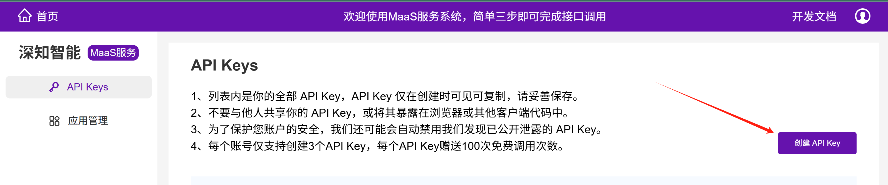
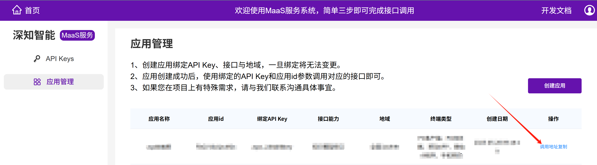

# 深知智能知识模型TrueBot

欢迎使用**深知智能 DeepKnown 可信知识模型服务**，该服务全量覆盖了全国所有行业以及所有城市区县的全量的法规政策、社会服务、社会治理以及行业规范等方面的规章知识，可以助力合作伙伴快速搭建可信AI产品。

本开源项目TrueBot，可帮助您快速接入深知智能DeepKnown可信知识模型服务，打造**社会服务与行业规章的智能对话交互产品**。其中，在运行项目前需要先进行知识模型API对接，可以访问 https://platform.dknowc.cn/#/home 了解对接详情，并注册和登录MaaS服务系统，进行API接入流程。


## 知识模型TrueBot介绍

知识模型TrueBot开源项目共有两部分，一部分是知识模型前端服务的功能，实现轻量化的对话界面，一部分是后端服务的功能，实现接入MaaS服务系统的知识模型API的功能。当您完成知识模型API接入后，进行简单配置即可运行此项目，可快速打造社会服务与行业规章的智能对话交互产品。


## 功能特点

TrueBot具有以下显著特点：
- **简单易用：** 界面友好，操作流程高度简化，可快速上手使用。
- **布局清晰：** 采用对话流式布局，边侧栏展示提问记录，区域清晰，体验感高。
- **开源免费：** 本项目遵循MIT开源协议，100%源代码开源。
- **响应式设计：** 在台式机、笔记本电脑和移动设备上提供无缝体验。
- **Markdown支持：** 通过全面的Markdown功能提升您的交互体验，实现丰富的交互。
- **多浏览器支持：** 对常见的浏览器，如 Chrome、Safari、Edge 等，均有良好的兼容性。
- **持续更新：** 我们致力于通过定期更新、修复和新功能来改进 TrueBot。


## 文件结构说明

```text
TrueBot/
├── src/
│   └── main/
│       ├── java/
│       │   └── com/dknowc/truebot/
│       │       ├── controller/              # 控制器层，定义对外接口
│       │       ├── service/                 # 服务层，封装业务逻辑
│       │       ├── utils/                   # 工具类
│       │       ├── Chat.java                # 请求对象类
│       │       └── TrueBotApplication.java  # 应用入口类
│       │
│       └── resources/
│           └── application.properties       # 配置文件
├── truebot/                                 # 静态资源目录
│   ├── img/                                 # 页面使用的图片资源
│   ├── js/                                  # 业务逻辑脚本
│   ├── link/                                # 样式表文件
│   └── index.html                           # 主页面
├── LICENSE                                  # 开源协议
├── pom.xml                                  # Maven 构建文件
└── README.md                                # 项目说明文档
```

## 前端服务使用说明
前端代码位于truebot文件夹下，为原生JS开发。

### 1.area.js 地域数据文件

### 2.config.js 配置文件
- chatUrl: 后端封 知识模型接口 后提供的地址。

### 3.index.js 主要逻辑文件
robotServerSseChat方法发起SSE请求。

**主要请求参数**
- **area**: 地域信息。
- **stream**: 流式与非流式接口选择项， true-流式，false-非流式。
- **material**: 是否需要参考资料，true-需要， false-不需要。
- **model**: R1-使用deepseek R1版本。


### 4.positioning.js 切换地域相关逻辑文件

### 5.marked.min.js Markdown解析器
接口输出的内容是markdown格式，需要解析后进行展示。


## 后端服务使用说明

### 使用流程

#### 1. 注册与获取 API Key

- 登录 [MaaS 服务系统](https://platform.dknowc.cn/#/home)
- 创建 API Key，获得 `AppKey` 与 `AppSecret`
  
- 创建应用并绑定 API Key，获取对应的接口调用地址
  

#### 2. 修改配置文件

将上述内容填写到 `application.properties` 文件中：

```properties
# MaaS平台授权信息
maas.appKey=你的AppKey
maas.appSecret=你的AppSecret
# MaaS知识模型接口地址
maas.chat.completion.url=你的知识模型接口调用地址
```

#### 3. 启动项目

配置完成后，启动项目，访问 ip:8088 即可访问本项目的轻量化前端界面，体验对话交互产品的使用效果。


## 前后端分离部署方式

前后端分离部署时，可将truebot下的静态资源和后端jar包分别上传到服务器，通过nginx代理后即可访问，以下为nginx配置示例，供参考。

#### 示例 Nginx 配置

```nginx
server {
    listen 80;
    server_name localhost;
    # 静态资源存放路径，按实际情况调整
    root /data/www;

    index index.html;

    location /maas/ {
        proxy_pass http://localhost:8088/maas/;
        proxy_http_version 1.1;
        proxy_set_header Host $host;
        proxy_set_header Connection '';
        chunked_transfer_encoding off;
        proxy_buffering off;
        proxy_cache off;
        proxy_set_header X-Real-IP $remote_addr;
        proxy_set_header X-Forwarded-For $proxy_add_x_forwarded_for;
    }
}
```
